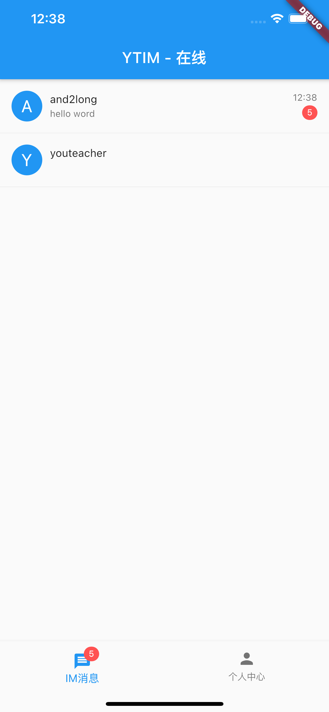
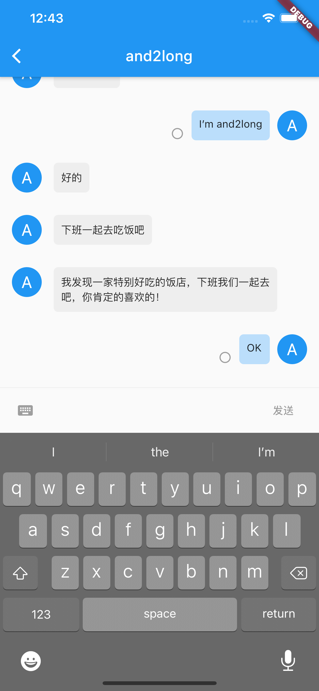

# flutter_ytim
## 概要
YouTeacher IM 快速开发SDK。
支持两种集成方式：
1. 快速集成。几行代码完成所有功能接入，使用内置UI界面。
2. 自定义集成。使用核心功能API，自定义联系人列表和聊天界面。

## 功能
- IM账号自动注册/登陆
- 联系人列表
- 未读消息红点显示
- 最后一条消息展示
- 1v1聊天
- 未读/已读状态显示
- 自己的消息撤回
- 被踢下线回调
- 内置UI组件国际化支持

## TODO
- UI定制

## 截屏
联系人列表 | 1v1聊天
--- | ---
 | 

## 使用方法

### 一、快速集成

1. 内置界面国际化配置
```
MaterialApp(
  localizationsDelegates: [
    // 这一行很重要，YTIM内置界面的文字国际化。
    YTIMLocalizations.delegate,
  ],
  home: IMContactsPage(header: AppBar(title: Text('YTIM'))),
)
```
2. 初始化
```
YTIM().init(
  imAppID: '8C5FA707436E824363ECF0172F408F2D',
  imAppSecret: '42C213D8A378EDA8034598CDF840823D',
  imAccount: 'and2long@gmail.com',
  imUsername: 'and2long',
  imUserCreatedCallback: (IMUser value) {
    print(value);
    // 创建IM用户成功，将IM用户信息与你自己的用户系统关联起来。
  },
  imLoginSuccessCallback: (IMUser value) {
    // IM用户登陆成功，取联系人列表。
    YTIM().getUserList(order: '4');
  },
);
```
3. 在程序回到前台时，检查IM连接状态。
```
YTIM().checkConnectStatus();
```
4. 断开连接，释放资源。
```
YTIM().release();
```

### 二、自定义集成。
#### 聊天功能核心API：
功能 | 方法
--- | ---
初始化 | YTIM().init
检查连接状态 | YTIM().checkConnectStatus
释放连接 | YTIM().release
被踢回调 | YTIM().addKickOutCallback
发送IM消息 | YTIM().send
发送已读回执 | YTIM().sendACK
撤销消息 | YTIM().revokeMessage
获取联系人列表 | YTIM().getUserList
获取未读消息 | YTIM().getUnreadMessage
获取历史消息列表 | YTIM().getHistoryMessage
获取用户资料 | YTIM().getProfile


`YTIM`使用Dart Streams来跟踪侦听器。
为特定事件注册监听器：
```
YTIM().on<IMMessage>().listen((event) { });
```
为所有事件注册监听器
```
YTIM().on().listen((event) {
    print(event.runtimeType);
});
```

#### 一些事件类型
事件 | 类名
--- | ---
消息 | IMMessage
用户信息 | IMUser
用户列表 | IMUserList
历史消息列表 | IMHistoryMsgList
未读消息列表 | IMUnreadMsgList
未读消息个数 | IMUnreadCount
IM指令类型 | IMCommand


#### 可用的全局变量
功能 | 方法
--- | ---
streamController | YTIM().streamController
自己的IM用户信息 | YTIM().mUser
当前正在与之聊天的用户id | YTIM().currentChatUserId


#### 用户信息操作接口
功能 | 方法
--- | ---
创建用户 | YTIM().addUser
编辑用户 | YTIM().editUser
删除用户 | YTIM().deleteUser
获取未读消息数量 | YTIM().getUnreadMessageCount


## 示例代码
[example project](https://github.com/and2long/flutter_ytim/tree/master/example)